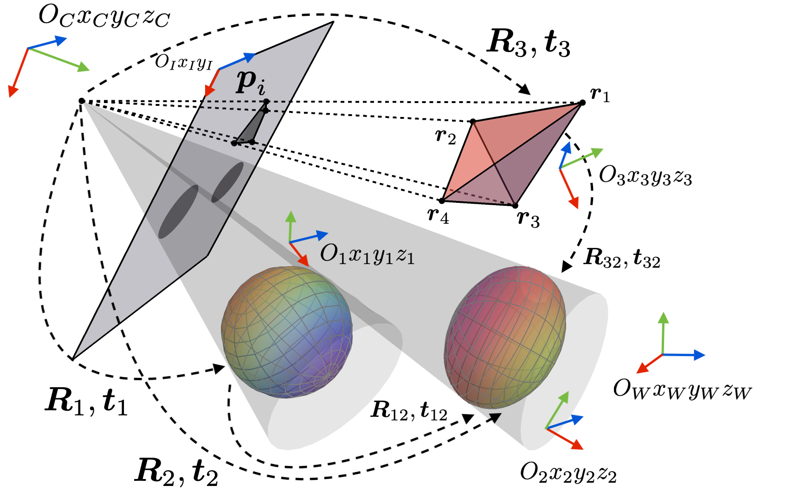

---


# Octave Version of LibQPEP
A library that deals with generalized quadratic pose estimation problems (QPEPs). The algorithm aims to obtain globally optimal pose together with globally optimal covariance estimates. Typically it can solve the following problems:

1. Perspective-n-Points (PnP)

2. Perspective-n-Lines (PnL)

3. Perspective-n-Points and Lines (PnPL)

4. Hand-eye Calibration

5. Point-to-plane Registration

6. Conics-based Camera Pose Estimation

7. Multi-robot relative pose problem from range measurements

8. Forward kinematics of parallel robots

9. Multi-GNSS attitude determination problem

# Authors
Affiliation: **RAM-LAB**, Hong Kong University of Science and Technology (**HKUST**)

Main Contributor: **Jin Wu** (https://github.com/zarathustr), jin_wu_uestc@hotmail.com

Core Contributors: **Xiangcheng Hu** (https://github.com/JokerJohn), **Ming Liu** (https://www.ece.ust.hk/eelium)


# Usage
The Octave is fully open-source by the GNU. The Octave Codes depend only on ```Forge``` packages and ```Python3``` packages. 

On terminal, intall ```Python3``` packages:
```
# Only SymPy 1.5.1 is working for Octave
pip3 install sympy==1.5.1
```

On Octave (launch by ```octave --gui``` for graphics version): 
```
pkg install -forge symbolic
pkg install -forge struct
pkg install -forge symbolic
```

After installation, run the two demo files in the root directory. Enjoy!

## C++ Version
Please refer to https://github.com/zarathustr/LibQPEP

## Publication
Wu, J., Zheng, Y., Gao, Z., Jiang, Y., Hu, X., Zhu, Y., Jiao, J., Liu*, M. (2020)
           Quadratic Pose Estimation Problems: Globally Optimal Solutions, 
           Solvability/Observability Analysis and Uncertainty Description.
